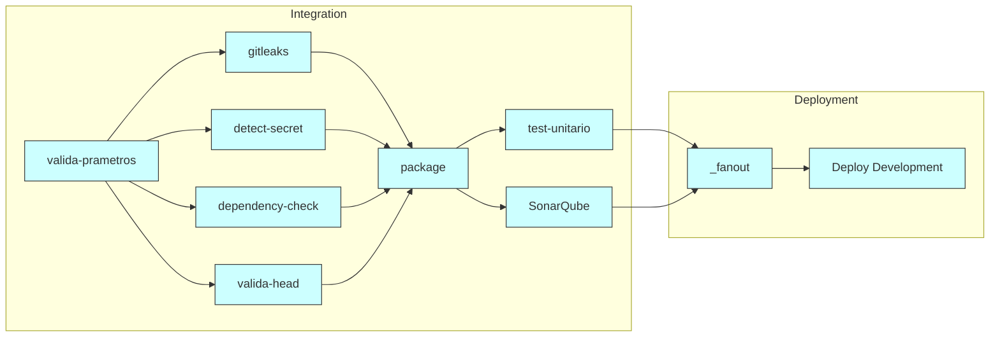
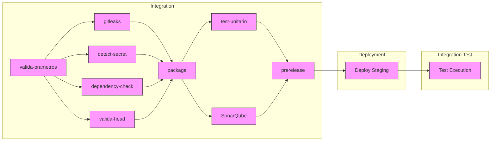
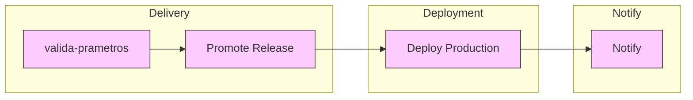
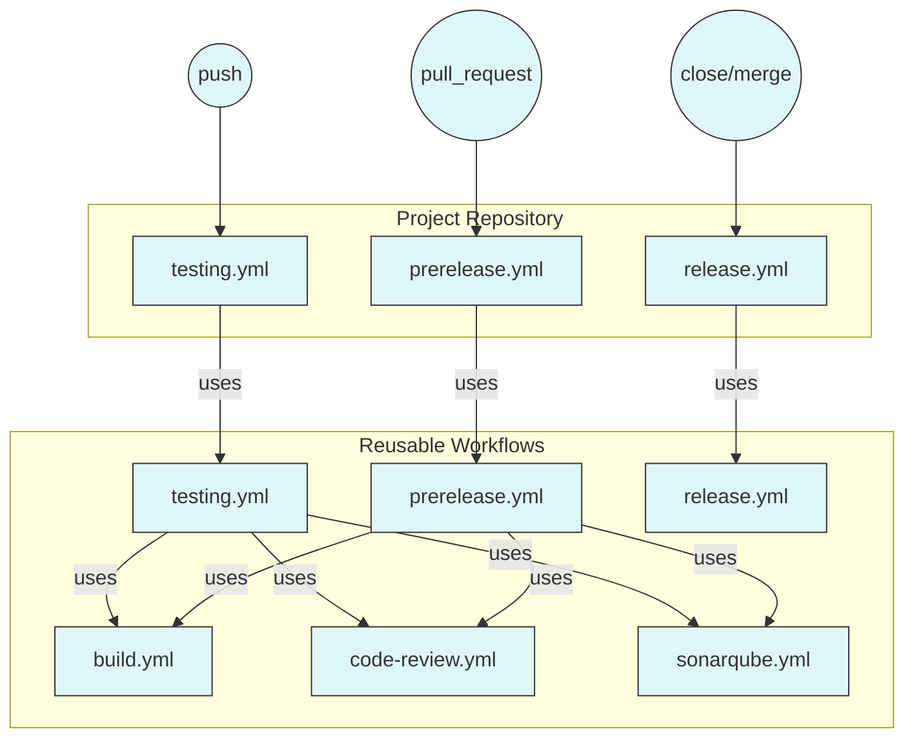

# Workflows

Este repositorio contiene los flujos de trabajo utilizados la para automatizar y estandarizar procesos.

## Estructura
- Todos los archivos y scripts relacionados con los workflows se encuentran en el directorio `workflows`.

## Diagramas

### Diagrama de Workflow Testing (testing.yml)



### Diagrama de Workflow PreRelease (prerelease.yml)



### Diagrama de Workflow Release (release.yml)



## ¿Cómo usar este repositorio?
Este repositorio está diseñado para ser utilizado como fuente de workflows reutilizables en GitHub Actions. No se ejecuta directamente, sino que se invoca desde otros proyectos siguiendo la documentación oficial de GitHub Actions para workflows reutilizables.

### Instrucciones para invocar un workflow reutilizable
1. Agrega la referencia al workflow en tu proyecto, por ejemplo en `.github/workflows/mi-flujo.yml`:
   ```yaml
   jobs:
     ejemplo:
       uses: mario-fribla-gonzalez/workflows/.github/workflows/nombre_del_workflow.yml@main
       with:
         parametro1: valor1
         parametro2: valor2
   ```
2. Consulta la documentación de cada workflow para conocer los parámetros disponibles y cómo configurarlos.
3. Para más información sobre workflows reutilizables, revisa la documentación oficial de GitHub Actions: https://docs.github.com/es/actions/using-workflows/reusing-workflows


## ¿Qué hace cada workflow?
A continuación se describe la finalidad de cada archivo YAML disponible en este repositorio:

- **build.yml**: Compila aplicaciones en distintos lenguajes (Node.js, .NET, etc.) y prepara el entorno para despliegue. Permite parametrizar el lenguaje, versión, tipo de despliegue y nombre de la aplicación.
- **code-review.yml**: Realiza revisiones automáticas de código para detectar secretos, credenciales y dependencias vulnerables usando herramientas como Gitleaks y Detect-Secrets. Ayuda a mantener la seguridad del repositorio.
- **prerelease.yml**: Compila y valida la aplicación antes de una liberación, permitiendo pruebas y revisiones previas. Despliega en ambiente de QA. Soporta múltiples lenguajes y frameworks, y puede configurarse para distintos entornos.
- **release.yml**: Automatiza la promoción y despliegue de versiones en ambiente de producción. Genera releases y ejecuta el despliegue según el tipo y nombre de la aplicación.
- **sonarqube.yml**: Ejecuta análisis de calidad y seguridad de código con SonarQube, descargando reportes de cobertura y dependencias, y enviando resultados al servidor SonarQube configurado.
- **testing.yml**: Ejecuta pruebas automáticas sobre la aplicación y despliega en ambiente de desarrollo, soportando distintos lenguajes y frameworks. Permite validar la funcionalidad antes de liberar o desplegar cambios.

## Diagrama de relación uses / workflow_call

Cada proyecto tiene sus propios archivos `testing.yml`, `prerelease.yml` y `release.yml` en `.github/workflows/`, los cuales llaman a los workflows reutilizables equivalentes de este repositorio usando `uses` y `workflow_call`.

**Triggers:**
- `testing.yml` se gatilla en un **push**
- `prerelease.yml` se gatilla en un **pull_request**
- `release.yml` se gatilla en un **close/merge** de pull request



## Autor
- DevOps Mario Fribla Gonzalez
